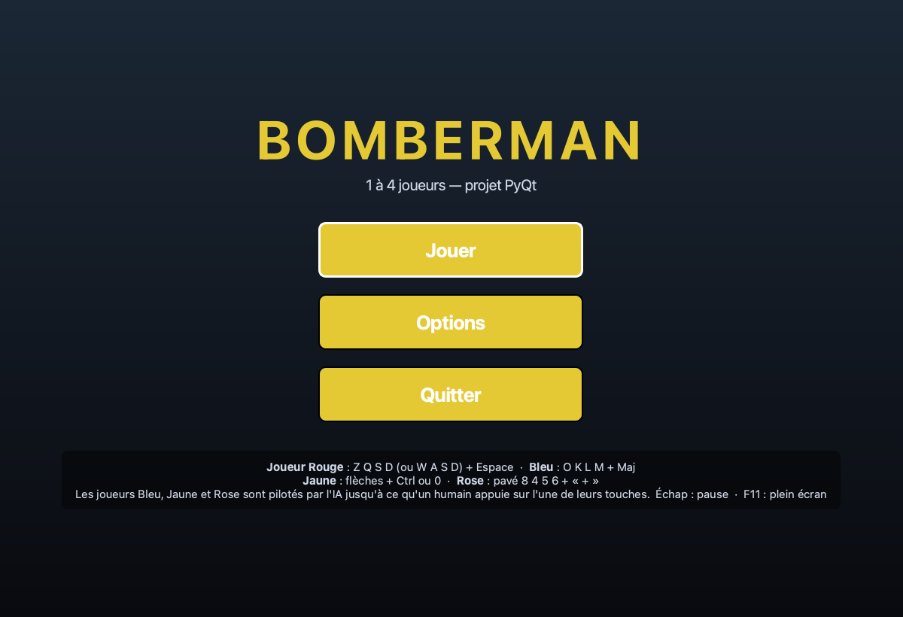
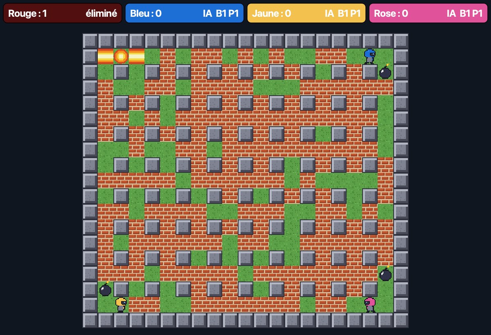

# Bomberman

Jeu de type *Bomberman* — un joueur contre trois IA — en **Python / PyQt6**. Éliminez vos
adversaires à coups de bombes ; les briques détruites libèrent des power-ups (portée, nombre de
bombes, bombe perforante) mais aussi des malus (crâne : contrôles inversés pendant 10 s).

Projet scolaire réalisé en groupe de trois personnes d'avril à juin 2019 (Python 3 + PyQt5),
entièrement audité et modernisé en 2026 — voir [`docs/AUDIT.md`](docs/AUDIT.md).

| Menu | Partie |
| --- | --- |
|  |  |

## Installation

Prérequis : Python ≥ 3.10 (le projet est développé et testé avec **3.14**).

Avec [uv](https://docs.astral.sh/uv/) (recommandé, installe la bonne version de Python) :

```bash
uv sync            # crée .venv, installe PyQt6 + outils de dev d'après uv.lock
uv run bomberman   # lance le jeu
```

Avec pip :

```bash
python -m venv .venv && source .venv/bin/activate
pip install -e .           # dépendances de jeu
pip install --group dev    # (optionnel) pytest + ruff — pip ≥ 25.1
python -m bomberman        # ou : python Main.py
```

Options : `--seed 42` (terrain reproductible), `--no-audio`, `--fullscreen`, `-v`.

## Commandes

Avant la partie, choisissez votre personnage (Rouge, Bleu, Jaune ou Rose — le choix est
mémorisé) ; les trois autres sont pilotés par l'IA.

| Action | Touches |
| --- | --- |
| Se déplacer | Z Q S D (ou W A S D) — ou les flèches |
| Poser une bombe | Espace |
| Pause | Échap |
| Plein écran | F11 |

## Règles

- Grille 21 × 19 : bordure et piliers indestructibles, briques destructibles (25 % retirées
  aléatoirement à chaque partie), quatre coins de départ dégagés.
- Une bombe explose 3 s après avoir été posée ; le souffle s'arrête sur la première brique (qu'il
  détruit) ou bombe (qu'il fait exploser en chaîne) ; une **bombe perforante** traverse tout sauf
  la pierre.
- Une brique détruite a 20 % de chances de laisser un power-up : portée + (45 %), bombe + (10 %),
  portée − (22,5 %), bombe − (12,5 %), crâne (5 %), bombe perforante (5 %).
- Score : +1 par brique détruite, +5 par adversaire éliminé. Le dernier survivant gagne ; à deux
  joueurs la musique passe en mode « duel ».

## Développement

```bash
uv run pytest                              # 54 tests (moteur, IA, générateur, UI hors écran)
uv run ruff check . && uv run ruff format . # lint + formatage
uv run python tools/generate_assets.py     # régénère images et sons (créations originales)
```

- `bomberman/model.py` — règles du jeu, sans Qt (testable unitairement)
- `bomberman/ai.py` — IA déterministe (survie → attaque → exploration)
- `bomberman/ui/` — fenêtre, menus, widget de jeu (clavier/horloge) et rendu (PyQt6)
- `bomberman/assets/` — pixel-art et chiptunes générés par `tools/generate_assets.py`
- `tests/` — pytest ; l'UI est testée avec `QT_QPA_PLATFORM=offscreen`
- `.github/workflows/ci.yml` — CI GitHub Actions (Python 3.10, 3.12, 3.14)
- `renovate.json` — mises à jour de dépendances automatisées (voir ci-dessous)

### Renovate

La configuration est prête (`renovate.json` : PyQt6 groupé, outils de dev et actions GitHub en
fusion automatique si la CI est verte, maintenance mensuelle de `uv.lock`). Pour l'activer, il
reste à installer l'application GitHub **Renovate** sur le dépôt :
<https://github.com/apps/renovate> → *Configure* → sélectionner `bomberman`.

## Assets et licence

Toutes les images et musiques sont des créations originales générées procéduralement par
`tools/generate_assets.py` (aucun contenu tiers). Le projet est sous licence
[MIT](LICENSE). PyQt6, utilisé comme dépendance, est distribué sous GPL v3.
